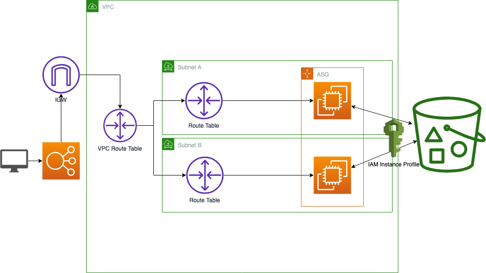

# AWS Lab

Follow this lab to gain a better understanding of the following topics:

* S3
* IAM
* VPC
* EC2
* Autoscaling
* Load Balancing


## Architecture




## Running

First make sure you've downloaded [terraform](https://www.terraform.io/downloads.html) and have [setup your AWS API keys](https://docs.aws.amazon.com/IAM/latest/UserGuide/id_credentials_access-keys.html#Using_CreateAccessKey) setup properly.

First we're going to initialize the repo pulling down the necessary terraform plugins, then setup the environment variables.
```
cd aws_lab
terraform init
export TF_VAR_public_key=$(cat ~/.ssh/id_rsa.pub)
export TF_VAR_s3_bucket="MY_BUCKET"
export TF_VAR_s3_bucket="MY_BUCKET_OBJECT"
```

Now we'll run the following to list out the changes terraform thinks it should make.

```
terraform plan
```

Now we'll actually make those changes. You'll have to type `yes` when prompted after having another look at the plan.

```
terraform apply
```

Once we have everything setup, you should be able to go to the [Load Balancers](https://us-west-2.console.aws.amazon.com/ec2/v2/home?region=us-west-2#LoadBalancers:sort=loadBalancerName) page, copy the link, and paste it in the browser.
